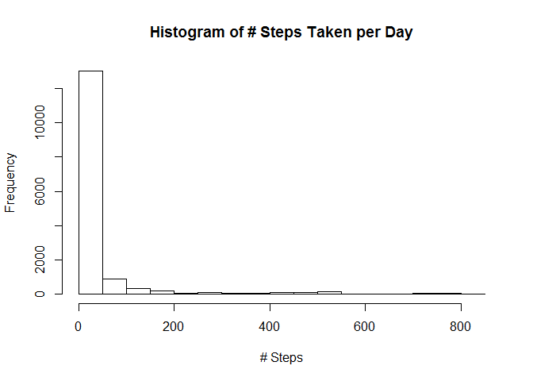
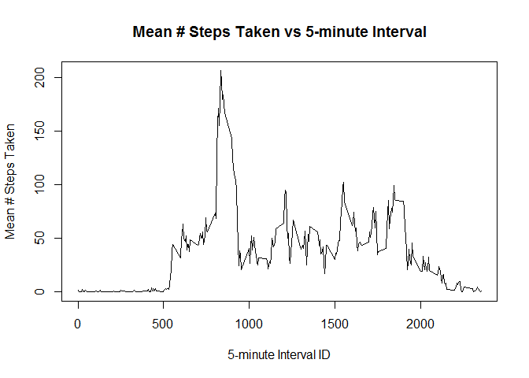
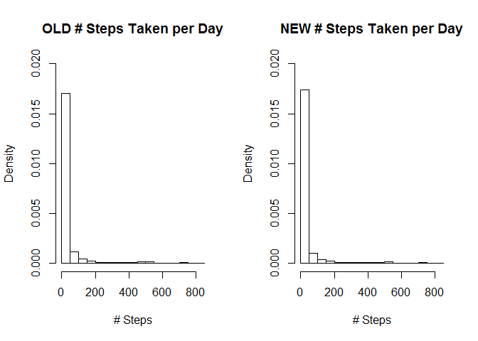
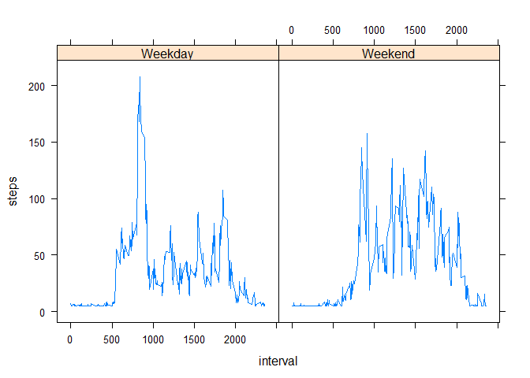

# Reproducible Research: Peer Assessment 1


## Loading and preprocessing the data


```r
act_na <- read.csv("activity/activity.csv")
act <- na.omit(act_na)
```


## What is mean total number of steps taken per day?


```r
hist(act$steps, main= "Histogram of # Steps Taken per Day", xlab = "# Steps")
```

 

####Calculate the mean and median number of steps taken per day.


```r
mean(act$steps)
```

```
## [1] 37.3826
```

```r
median(act$steps)
```

```
## [1] 0
```


## What is the average daily activity pattern?

####Create a time series plot of average number of steps taken for each 5-minute interval across all days.

```r
interval_means <- tapply(act$steps, INDEX = act$interval, FUN = mean)
intervals <- sort(unique(act$interval))
plot(intervals, interval_means, type = "l", main = "Mean # Steps Taken vs 5-minute Interval", ylab = "Mean # Steps Taken", xlab = "5-minute Interval ID")
```

 

####Which 5-minute interval, on average across all the days in the dataset, contains the maximum number of steps?

```r
max_mean_index <- which.max(interval_means)
paste("Interval #" , intervals[max_mean_index], sep = "")
```

```
## [1] "Interval #835"
```

## Imputing missing values

####1. Calculate and report the total number of missing values in the dataset (i.e. the total number of rows with NAs)

```r
num_na_rows <- length(which(!complete.cases(act_na)))
num_na_rows
```

```
## [1] 2304
```

####Find the mean number of steps and fill in the NA values with the mean.

```r
mean_step <- mean(act$steps)
na_rows <- which(!complete.cases(act_na))
act_na$steps[na_rows] <- mean_step
```

Check to make sure it worked by finding the new number of NA rows.


```r
new_num_na_rows <- length(which(!complete.cases(act_na)))
new_num_na_rows
```

```
## [1] 0
```

####Make a histogram of the total number of steps taken each day and Calculate and report the mean and median total number of steps taken per day.

First plot the histogram for the data with filled NA values alongside the original histogram of the number of steps. Be sure to set freq = F so that the histogram shows probabilities and not raw counts, since the dataset where NA values were simply removed will inherently have lower counts.


```r
par(mfrow=c(1,2))
hist_old <- hist(act$steps, main= "OLD # Steps Taken per Day", xlab = "# Steps", ylim = c(0, 0.02), freq = F)
hist_new <- hist(act_na$steps, main= "NEW # Steps Taken per Day", xlab = "# Steps", ylim= c(0, 0.02), freq = F)
```

 

```r
par(mfrow=c(1,1))
```

Now find the old and new values for mean and median.


```r
old_mean <- mean(act$steps)
new_mean <- mean(act_na$step)
old_mean ; new_mean
```

```
## [1] 37.3826
```

```
## [1] 37.3826
```

```r
old_median <- median(act$steps)
new_median <- median(act_na$steps)
old_median ; new_median
```

```
## [1] 0
```

```
## [1] 0
```

Neither the median nor the mean has changed as a result of filling in the NA values in the 'steps' column with the mean value. A preliminary look at the histograms doesn't reveal any huge differences either. However, when you look at the actual density values in the plots there are some small changes:


```r
data.frame(OLD_DENSITIES= hist_old$density, NEW_DENSITIES = hist_new$density)
```

```
##    OLD_DENSITIES NEW_DENSITIES
## 1   1.702306e-02  1.741348e-02
## 2   1.170073e-03  1.016621e-03
## 3   4.350105e-04  3.779599e-04
## 4   2.659853e-04  2.311020e-04
## 5   1.008910e-04  8.765938e-05
## 6   1.257862e-04  1.092896e-04
## 7   1.100629e-04  9.562842e-05
## 8   1.008910e-04  8.765938e-05
## 9   1.205451e-04  1.047359e-04
## 10  1.441300e-04  1.252277e-04
## 11  1.755765e-04  1.525501e-04
## 12  2.882600e-05  2.504554e-05
## 13  2.751572e-05  2.390710e-05
## 14  2.751572e-05  2.390710e-05
## 15  8.778826e-05  7.627505e-05
## 16  5.372117e-05  4.667577e-05
## 17  2.620545e-06  2.276867e-06
```

Clearly, filling NAs with the mean value has made a small change in the distribution of the number of steps.

## Are there differences in activity patterns between weekdays and weekends?

####Create a new factor variable in the dataset with two levels - "weekday" and "weekend" indicating whether a given date is a weekday or weekend day.


```r
library(lubridate)
```

```
## Warning: package 'lubridate' was built under R version 3.1.3
```

```r
library(lattice)
library(tidyr)
```

```
## Warning: package 'tidyr' was built under R version 3.1.3
```

```r
#using lubridate, assign a boolean value indicating whether or not a given date is a weekday
act_na$weekday <- !wday(act_na$date) %in% c(1,7)

#then use this new weekday factor to calculate the mean for each interval, for both weekdays and weekends.
interval_means_wkday <- as.data.frame(tapply(act_na$steps, INDEX = list(act_na$interval, act_na$weekday), FUN = mean))

#the intervals were put as the rownames in the result of tapply, so move them to a column in the dataframe
interval_means_wkday$interval <- as.numeric(rownames(interval_means_wkday))

tidy_means_wkdy <- gather(interval_means_wkday, key = "weekday", value = "steps", -interval)
tidy_means_wkdy$weekday <- as.logical(tidy_means_wkdy$weekday)
weekday_indices <- which(tidy_means_wkdy$weekday)

tidy_means_wkdy$weekday[weekday_indices] <- "Weekday"
tidy_means_wkdy$weekday[-weekday_indices] <- "Weekend"
```

####Plot steps taken for weekdays and weekends by 5-minute interval.

```r
xyplot(steps ~ interval |  weekday, data= tidy_means_wkdy, type = "l")
```
From the disparate shapes of the plots, we can say that activity patterns are different between weekends and weekdays

 
